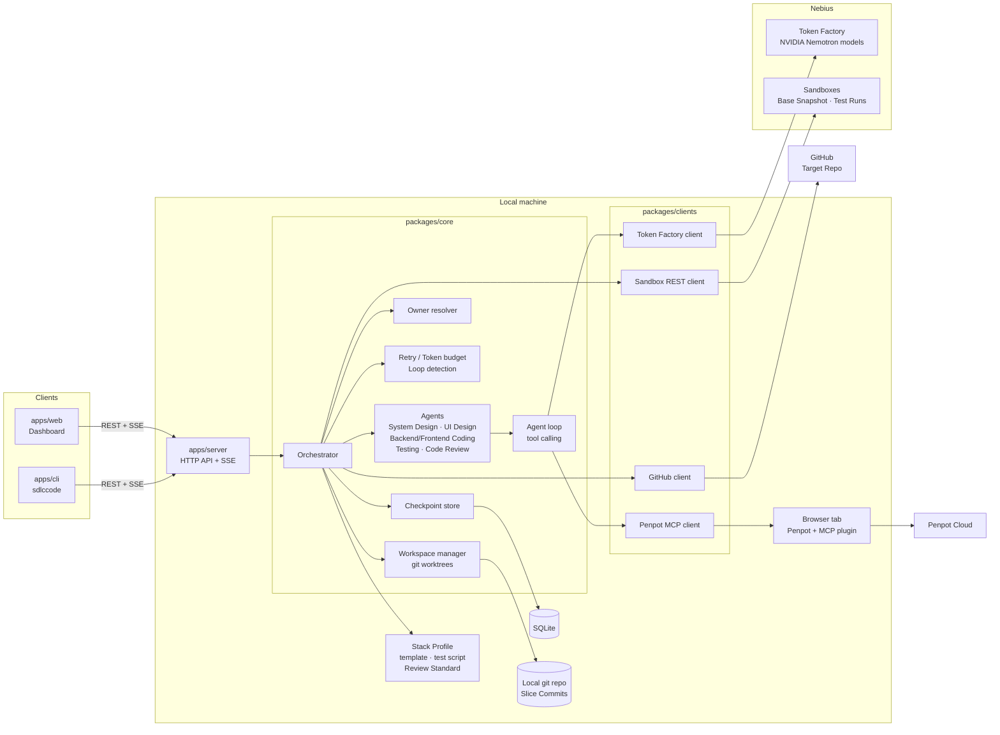
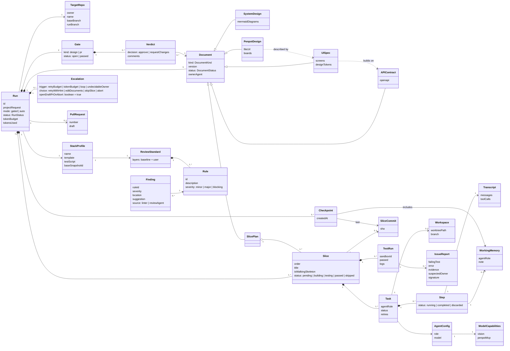
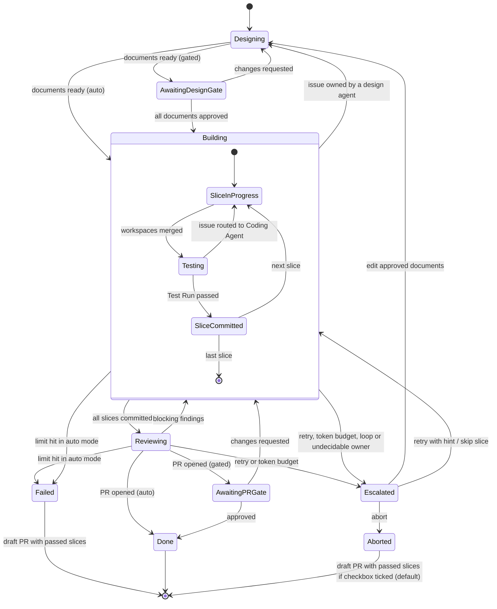
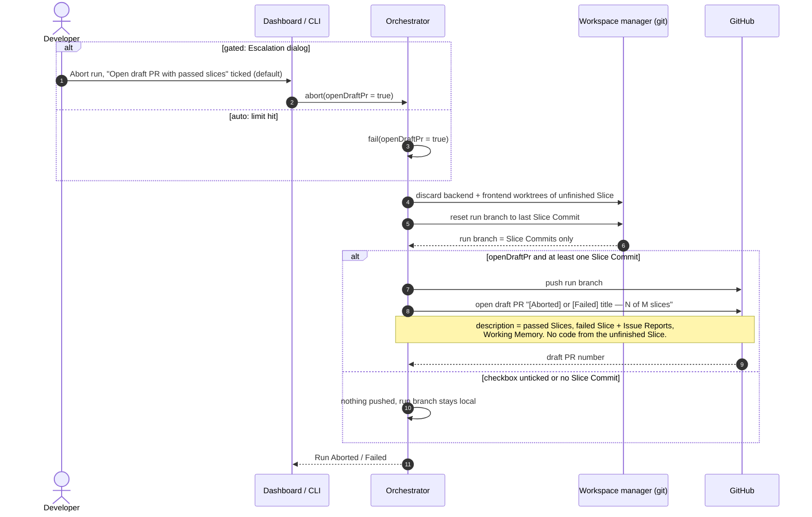
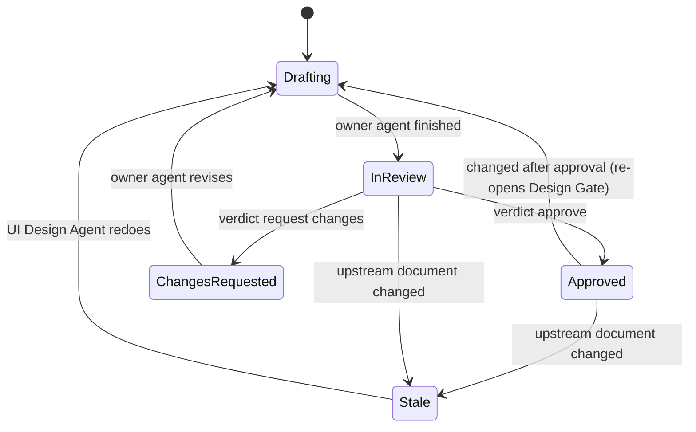
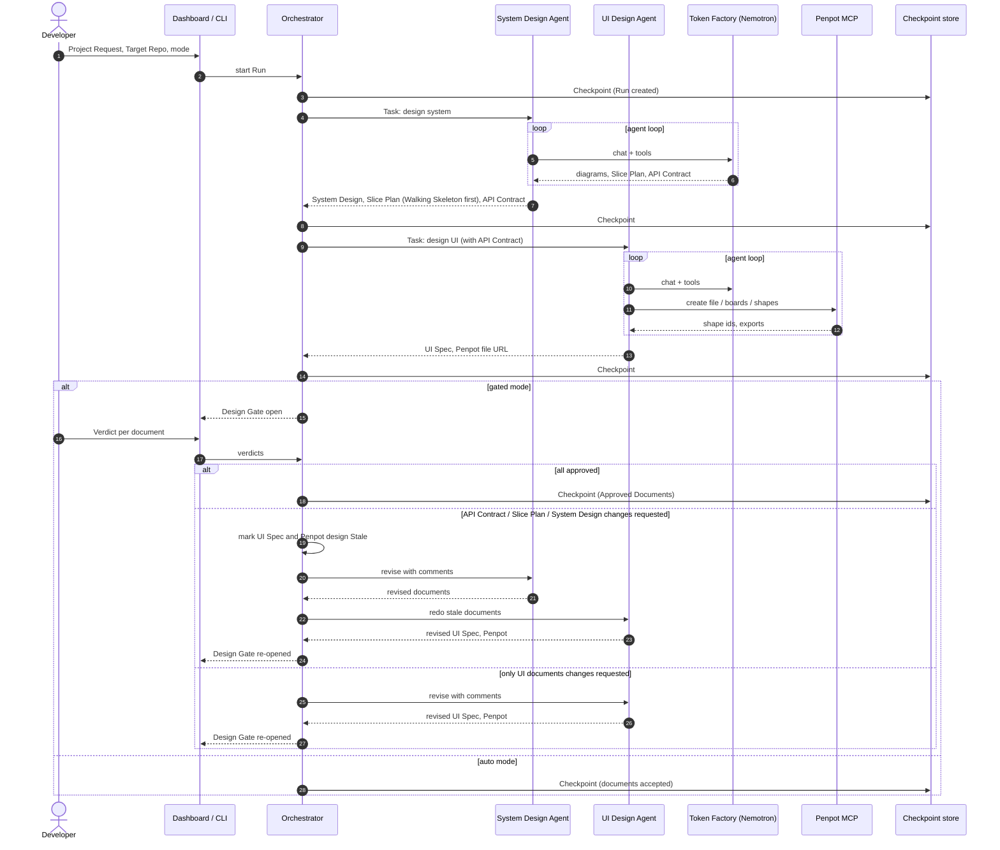
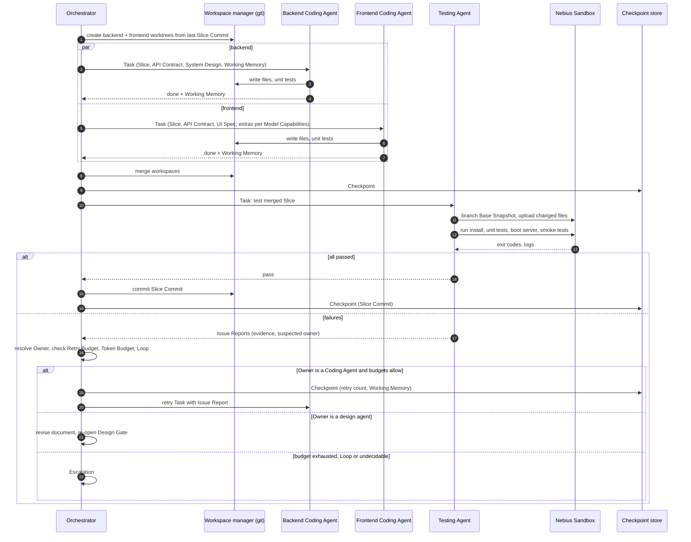
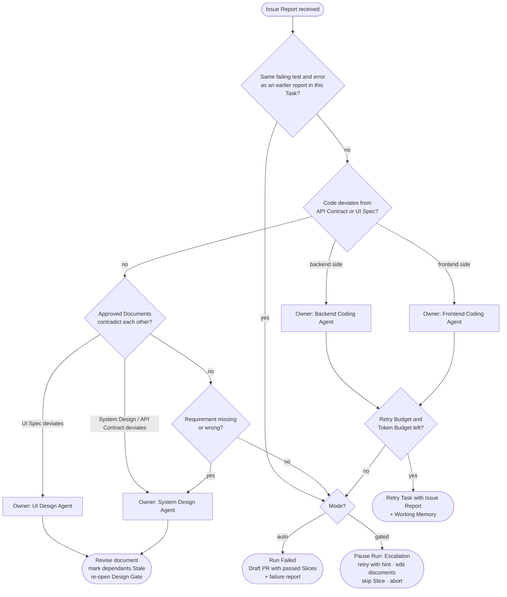
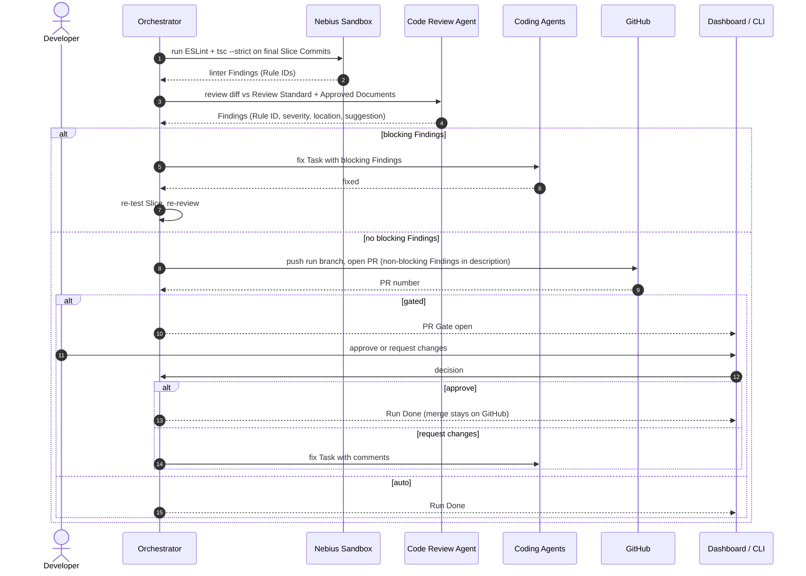
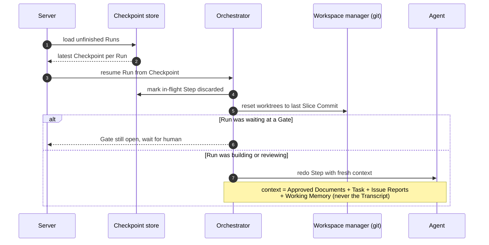

# sdlc-code — UML

Design-phase diagrams for review. Terms follow [CONTEXT.md](../../CONTEXT.md); the key storage decision is [ADR 0001](../adr/0001-local-git-is-source-of-truth-sandbox-only-executes.md). UI screens live in the Penpot file "sdlc-code dashboard".

1. [Component diagram](#1-component-diagram)
2. [Domain class diagram](#2-domain-class-diagram)
3. [Run lifecycle](#3-run-lifecycle-state) and [stopping early](#3b-stopping-early--what-goes-into-the-draft-pr-sequence)
4. [Document lifecycle](#4-document-lifecycle-state)
5. [Design Phase and Design Gate](#5-design-phase-and-design-gate-sequence)
6. [Slice execution](#6-slice-execution-sequence)
7. [Owner resolution and escalation](#7-owner-resolution-and-escalation-activity)
8. [Code review and PR Gate](#8-code-review-and-pr-gate-sequence)
9. [Resume after restart](#9-resume-after-restart-sequence)

## 1. Component diagram

One local server owns every Run; the dashboard and CLI are thin clients. Agents run locally and call Nebius Token Factory for inference. The sandbox only executes Test Runs.

## 2. Domain class diagram

## 3. Run lifecycle (state)

## 3b. Stopping early — what goes into the Draft PR (sequence)

Applies to an auto-mode failure and to an abort with "Open draft PR" ticked. Only Slice Commits are pushed; the unfinished Slice's worktrees are discarded and never merged into the run branch.

Any Run state except `Done`, `Failed` and `Aborted` can be interrupted and resumed from its last Checkpoint (see diagram 9).

## 4. Document lifecycle (state)

Upstream relationships: System Design, Slice Plan and API Contract → UI Spec and Penpot design.

## 5. Design Phase and Design Gate (sequence)

## 6. Slice execution (sequence)

## 7. Owner resolution and escalation (activity)

## 8. Code review and PR Gate (sequence)

## 9. Resume after restart (sequence)

